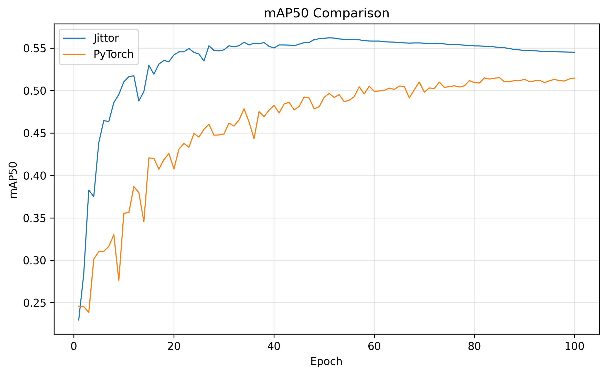
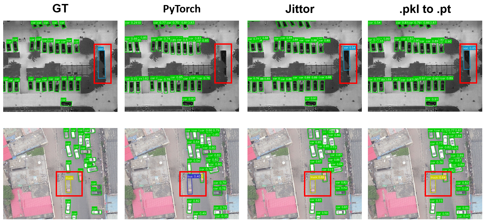
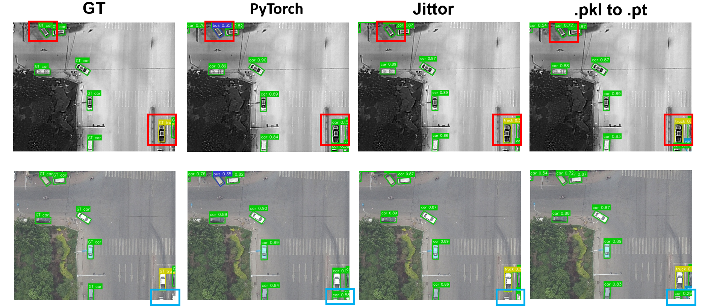
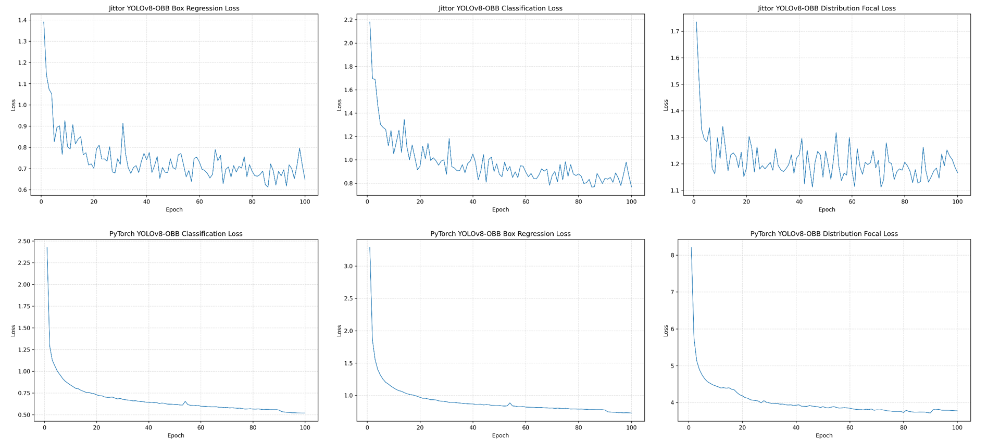
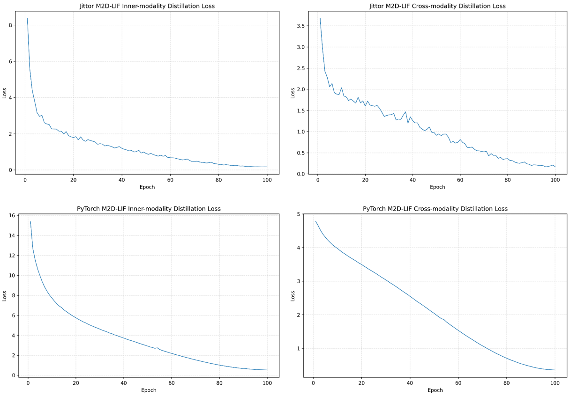
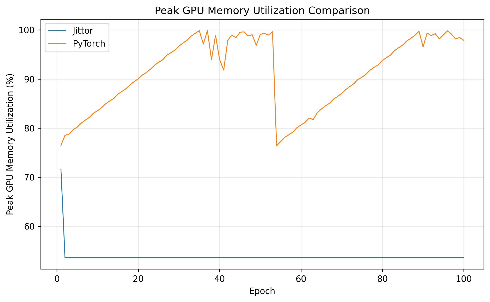

# Jittor M2D-LIF

This repository provides a Jittor-based reproduction and extension of **M2D-LIF** for visible-infrared oriented object detection. The implementation is built on top of **JDet**, and first ports the YOLOv8-OBB detection framework to Jittor. Based on this single-modal YOLOv8-OBB detector, the repository further implements a dual-modal M2D-LIF-style distillation framework for the DroneVehicle dataset.

> Original M2D-LIF repository: <https://github.com/Zhao-Tian-yi/M2D-LIF>  
> JDet repository: <https://github.com/Jittor/JDet>

## 1. Project Overview

The main goal of this repository is to reproduce the core training and inference pipeline of M2D-LIF under the Jittor deep learning framework.

The implementation contains two main parts:

1. **Jittor YOLOv8-OBB**
   - Implements a YOLOv8-style oriented object detector based on JDet.
   - Supports DroneVehicle-style OBB labels.
   - Provides training, validation, and visualization scripts for single-modal RGB or infrared detection.

2. **Jittor M2D-LIF**
   - Extends the Jittor YOLOv8-OBB detector to a visible-infrared dual-modal detection framework.
   - Uses single-modal teacher models to guide dual-modal student training.
   - Provides training, validation, and visualization scripts for dual-modal OBB detection.

This repository is not a fully packaged one-click experimental benchmark. It is intended as a research-oriented reproduction codebase. Paths, dataset roots, checkpoint paths, and some experiment-specific settings should be modified according to the local environment before running.

## 2. Tested Environment

The following environment was used during development and testing.

### Operating System

```bash
Ubuntu 22.04.1 LTS
Linux kernel: 5.15.0-97-generic
```

### Python

```bash
Python 3.10.20
Conda environment: Jittor_py310
```

### GPU and CUDA

```bash
GPU: NVIDIA GeForce RTX 4090
GPU memory: 24564 MiB
NVIDIA Driver: 580.76.05
CUDA shown by nvidia-smi: 13.0
NVCC: 11.8.89
GCC/G++: 11.3.0
```

### Main Python Dependencies

```bash
jittor==1.3.10.0
numpy==1.23.5
opencv-python==4.11.0.86
matplotlib==3.10.9
pillow==12.2.0
pycocotools==2.0.11
PyYAML==6.0.3
scipy==1.15.3
shapely==2.1.2
tensorboardX==2.6.5
terminaltables==3.1.10
tqdm==4.67.3
nvidia-ml-py3==7.352.0
```

PyTorch and Ultralytics were not installed in the tested Jittor environment. This repository mainly runs under Jittor.

## 3. Dataset Preparation

The project uses a M2D-LIF-style visible-infrared dataset layout.

```text
5000-DroneVehice/
├── images/
│   ├── train/
│   └── val/
├── images_ir/
│   ├── train/
│   └── val/
├── labels/
│   ├── train/
│   └── val/
├── train.txt
└── val.txt
```

Example class names:

```text
car
truck
bus
van
freight_car
```

### DroneVehicle Dataset

The DroneVehicle dataset can be downloaded from the following BaiduYun links:

- Train: <https://pan.baidu.com/s/1ptZCJ1mKYqFnMnsgqEyoGg>  
  Extraction code: `ngar`
- Validation: <https://pan.baidu.com/s/1e6e9mESZecpME4IEdU8t3Q>  
  Extraction code: `jnj6`
- Test: <https://pan.baidu.com/s/1JlXO4jEUQgkR1Vco1hfKhg>  
  Extraction code: `tqwc`

After downloading the dataset, please adjust the dataset root and split paths in the corresponding config files.

### Dataset Preprocessing

Before training, preprocess the original DroneVehicle dataset with:

```bash
python /root/M2D-LIF_Jittor/tools/pre.py
```

This script crops the images in the DroneVehicle dataset into $640 \times 640$ patches.

After preprocessing, select the first 5000 images from the training set with:

```bash
python /root/M2D-LIF_Jittor/move.py
```

This script constructs the \texttt{5000-DroneVehice} subset used in the experiments.

Please make sure the dataset paths in \texttt{pre.py}, \texttt{move.py}, and the related config files are modified according to your local environment before running the scripts.

## 4. Single-Modal YOLOv8-OBB

Single-modal training can be used to train RGB or infrared teacher models. These teacher checkpoints can then be used by the M2D-LIF dual-modal distillation branch.

### 4.1 Training

Run the following command from the repository root:

```bash
python projects/yolov8_obb/run_net.py \
  --config-file projects/yolov8_obb/configs/yolov8n_obb_dronevehicle_teacher.py
```

This trains a single-modal YOLOv8-OBB teacher model.

Before running, check the following items in the config file:

- Dataset root.
- Train and validation image paths.
- Label paths.
- Number of classes.
- Class names.
- Batch size.
- Image size.
- Work directory.
- Checkpoint save path.

### 4.2 Validation

Example command for validating a single-modal checkpoint:

```bash
PYTHONPATH=/root/JDet/python python val_jittor_single_obb_map.py \
  --weights /root/JDet/work_dirs/RGB-full.pkl \
  --source /root/JDet/5000-DroneVehice/images/val \
  --label-dir /root/JDet/5000-DroneVehice/labels/val \
  --cfg /root/JDet/projects/yolov8_obb/configs/yolo_configs/yolov8n_obb.yaml \
  --imgsz 640 \
  --scale n \
  --nc 5 \
  --conf 0.25 \
  --iou 0.7 \
  --use-cuda 1
```

For infrared validation, change `--source` to the corresponding `images_ir/val` directory and use the matching infrared checkpoint.

### 4.3 Visualization

Example command for visualizing single-modal predictions:

```bash
PYTHONPATH=/root/JDet/python python tools/vis_single_yolov8_obb_pred.py \
  --weights /root/JDet/work_dirs/RGB-full.pkl \
  --source /root/JDet/5000-DroneVehice/images/val \
  --cfg /root/JDet/projects/yolov8_obb/configs/yolo_configs/yolov8n_obb.yaml \
  --out-dir /root/JDet/runs/vis_single_rgb \
  --imgsz 640 \
  --scale n \
  --nc 5 \
  --conf 0.25 \
  --iou 0.7 \
  --use-cuda 1 \
  --names "car,truck,bus,van,freight_car"
```

## 5. M2D-LIF Dual-Modal Training

The M2D-LIF branch is placed under:

```text
jittor-yolov8/
```

The dual-modal branch takes RGB and infrared images as paired inputs and trains a dual-modal student model with teacher guidance.

### 5.1 Training

Example command:

```bash
PYTHONPATH=/root/JDet/jittor-yolov8/python python /root/JDet/jittor-yolov8/projects/yolov8_obb/run_net.py \
  --config-file /root/JDet/jittor-yolov8/projects/yolov8_obb/configs/yolov8n_obb_DroneVehicle_M2D-LIF.py
```

Before training, check the config file carefully, especially:

- RGB image root.
- IR image root.
- Label root.
- Teacher checkpoint paths.
- Student model YAML.
- Number of classes.
- Distillation loss weights.
- Batch size.
- Work directory.
- Checkpoint save directory.

### 5.2 Validation

Example command:

```bash
PYTHONPATH=/root/JDet/jittor-yolov8/python python /root/JDet/jittor-yolov8/val_jittor_m2dlif_obb_map.py \
  --weights /root/JDet/work_dirs/DroneVehicle_M2D-LIF/checkpoints/best.pkl \
  --source /root/JDet/test/images \
  --ir-root /root/JDet/test/images_ir \
  --label-dir /root/JDet/test/labels \
  --cfg /root/JDet/jittor-yolov8/projects/yolov8_obb/configs/yolo_configs/yolov8n_LIF_obb.yaml \
  --imgsz 640 \
  --scale n \
  --nc 5 \
  --conf 0.25 \
  --iou 0.7 \
  --use-cuda 1
```

### 5.3 Visualization

Example command:

```bash
PYTHONPATH=/root/JDet/jittor-yolov8/python python tools/vis_m2d_lif_obb_pred.py \
  --weights /root/JDet/work_dirs/DroneVehicle_M2D-LIF/checkpoints/best.pkl \
  --source /root/JDet/test/images \
  --view-modal concat \
  --out-dir /root/JDet/jittor-yolov8/runs/vis_concat
```

The `--view-modal concat` option is used to visualize the dual-modal prediction result in a concatenated RGB/IR view.

## 6. Checkpoint Notes

Trained weights are provided through BaiduYun:

- File: `M2D-LIF_Jittor_weights`
- Link: <https://pan.baidu.com/s/1u2xalvD3TuqOy45XGPFWGA>
- Extraction code: `2605`

## 7. Experimental Logs and Performance Comparison

This section provides representative experimental logs and qualitative visualization results. The figures are intended to document the training trend, GPU memory behavior, detection accuracy, and visual detection results obtained during the reproduction process.

> Note: The current repository is a research reproduction and extension codebase. The reported curves are used to describe the reproduced experimental behavior under the tested environment. Since the Jittor and PyTorch validation implementations may not be completely identical, the curves should be interpreted as experimental logs rather than a strictly unified benchmark.

### 7.1 Detection Performance Curves

The following figure shows the mAP50 curves. The comparison includes single-modal baselines and the reproduced M2D-LIF dual-modal model. These curves are used to analyze the accuracy trend across epochs.



### 7.2 YOLOv8-OBB Single-Modal Detection Visualization

The following figure shows representative single-modal YOLOv8-OBB oriented detection results. It is mainly used to verify that the Jittor YOLOv8-OBB detector can correctly perform oriented bounding box prediction on DroneVehicle-style aerial images.



### 7.3 M2D-LIF Dual-Modal Visualization

The following visualization shows representative dual-modal detection results of the M2D-LIF branch. The results are shown in a concatenated RGB/IR view to make the visible-infrared correspondence easier to inspect.



### 7.4 M2D-LIF Training Loss Logs

The following figure records the main loss curves during M2D-LIF training, including the detection loss and additional distillation-related losses. These logs are useful for checking whether the dual-modal student model is optimized normally and whether the distillation terms remain numerically stable.




### 7.5 GPU Memory Usage Logs

The following figure compares GPU memory usage during training. It is used to analyze the runtime cost of the reproduced Jittor implementation, especially under the dual-modal M2D-LIF setting where two modalities and teacher-guided feature distillation are involved.




## 8. Reference

- Jittor：<https://github.com/Jittor>
- JDet：<https://github.com/Jittor/JDet>
- Ultralytics YOLO: <https://github.com/ultralytics/ultralytics>
- M2D-LIF：<https://github.com/Zhao-Tian-yi/M2D-LIF> 
- DroneVehicle dataset: <https://github.com/VisDrone/DroneVehicle>
